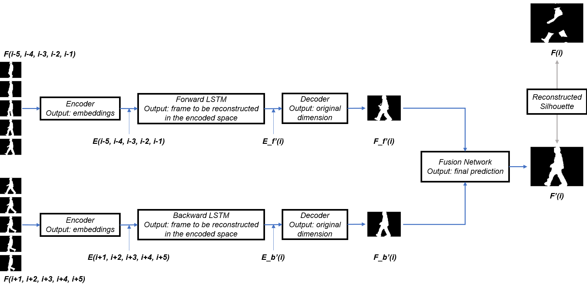
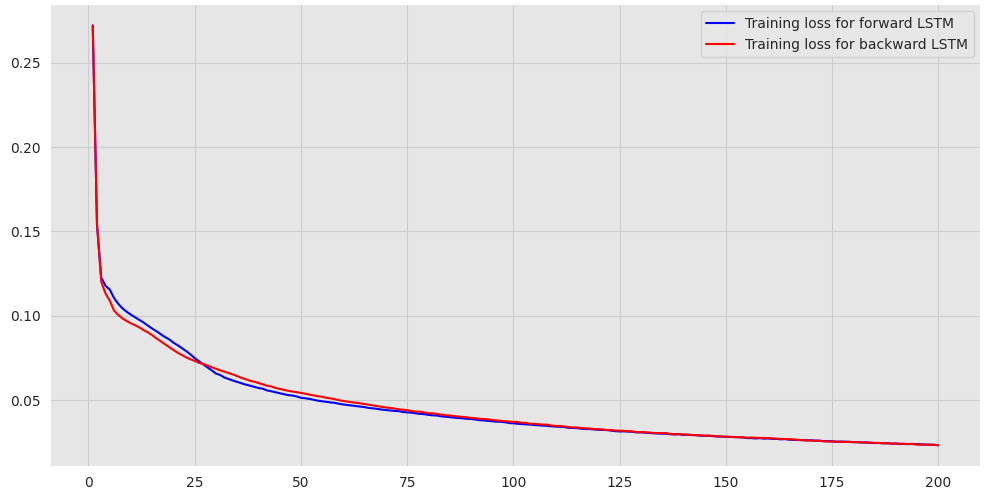
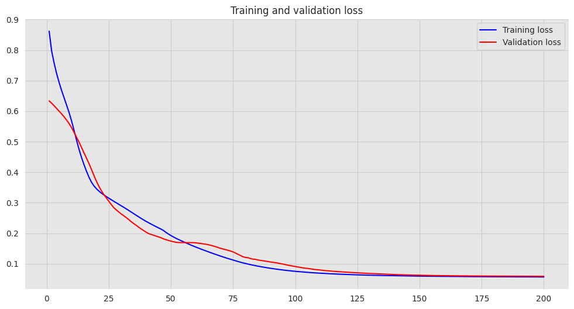
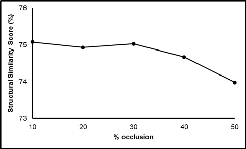
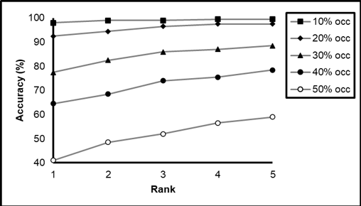

# GAIT RECOGNITION THROUGH RECONSTRUCTING OCCLUDED FRAMES IN GAIT SEQUENCES USING A FORWARD-BACKWARD LSTM MODEL

This is the implementation of gait reconstruction through a forward-backward LSTM model followed by recognition. The intuition behind this is shown below:

An effective neural network-based model is modeled to reconstruct the corrupted frames. Specifically, a 3 layered structure is used to predict the occluded frames from the frames previous and post the frames to be predicted. A convolutional encoder network is tuned, followed by Long Short Term Memory (LSTM) layer. The output embeddings are used as inputs for the LSTM layer which has been trained to optimize a loss function which reconstructs the frames in the encoded space. The LSTM layer is followed by a convolutional decoder network. The predicted embedding is decoded by this network. The effectiveness of the algorithm has been evaluated based on the structural similarity score between the predicted and ground truth images and gait-based recognition techniques. For testing, the CASIA-B gait dataset is used.

The architecture for the reconstruction model is shown below:

## TEST RESULTS:

### Training and Validation loss for the autoencoder network.

### Training and validation loss for forward and backward LSTMs.

### Training and Validation loss for the fusion network.

### Averaged structural similarity scores between the GEIs of reconstructed and original sequences of 79 subjects with varying occlusion.

### Rank based accuracy through CMC curves on testing for recognition on the CASIA-B gait dataset.

Some important tools:
- Python
- Tensorflow
- NumPy
- OpenCV